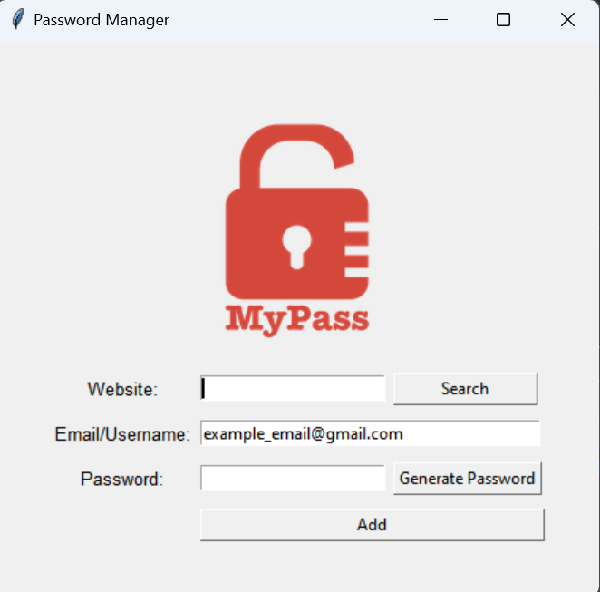

# Password Manager

A simple password manager built with Python and Tkinter that allows users to generate, save, and retrieve passwords securely. The application ensures passwords are complex by including numbers, letters, and symbols and allows users to store and search for passwords associated with different websites.

## Features

- **Password Generation**: Generate random, secure passwords that include numbers, letters, and symbols.
- **Password Storage**: Save passwords along with the associated website and email/username in a JSON file.
- **Password Retrieval**: Search for saved passwords by entering the website name.
- **Clipboard Copying**: Automatically copy the generated password to the clipboard for easy pasting.

## Installation

1. Clone the repository:
    ```bash
    git clone https://github.com/Michael-Senkao/password-manager.git
    cd password-manager
    ```

2. Install the required dependencies:
    ```bash
    pip install -r requirements.txt
    ```

3. Run the application:
    ```bash
    python main.py
    ```

## Usage

1. **Generate a Password**: Click on "Generate Password" to create a new password. The password will be displayed in the "Password" field and copied to your clipboard.
2. **Save a Password**:
   - Enter the website name in the "Website" field.
   - Enter the email/username in the "Email/Username" field.
   - Enter the password in the "Password" field (or use the generated password).
   - Click on "Add" to save the information.
3. **Search for a Password**:
   - Enter the website name in the "Website" field.
   - Click on "Search" to retrieve the saved email/username and password for the entered website.

## Project Structure

- `main.py`: The main script that runs the application.
- `characters.py`: Contains the characters used for password generation.
- `passwords.json`: The JSON file where passwords are stored (automatically created after saving the first password).

## Screenshots



## Contributing

Contributions are welcome! Please feel free to submit a Pull Request.

## License

This project is licensed under the [MIT License](https://opensource.org/licenses/MIT).

## Acknowledgements

- [Tkinter](https://docs.python.org/3/library/tkinter.html): Python's standard GUI package.
- [Pyperclip](https://github.com/asweigart/pyperclip): A cross-platform Python module for clipboard functions.

## Contact

For any questions or feedback, please contact [senkaomichael@gmail.com](mailto:senkaomichael@gmail.com).